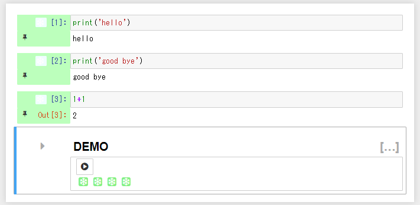
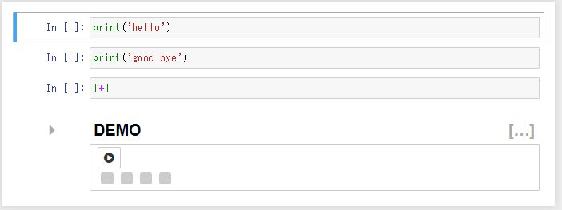

# Initialize Jupyter Notebook File(ipynb) on access

## Summary

This feature has the following effects on the ipynb file and execution environment by adding a parameter to the URL to access a specific ipynb file in the Jupyter Notebook environment.

* Effect on ipynb files
  * Clear the freeze status of all cells
  * Clear the result output on ipynb files
* Effects on the execution environment
  * Restart the kernel

## Usage

### 1. Prepare an executed ipynb file

Access URL : `https://domain/............./notebooks/demo_nb.ipynb`

### 2. Initialize ipynb file by accessing with URL with initialization parameters

Add `init_nb=true` to the access URL parameter.

Access URL : `https://domain/............./notebooks/demo_nb.ipynb?init_nb=true`

